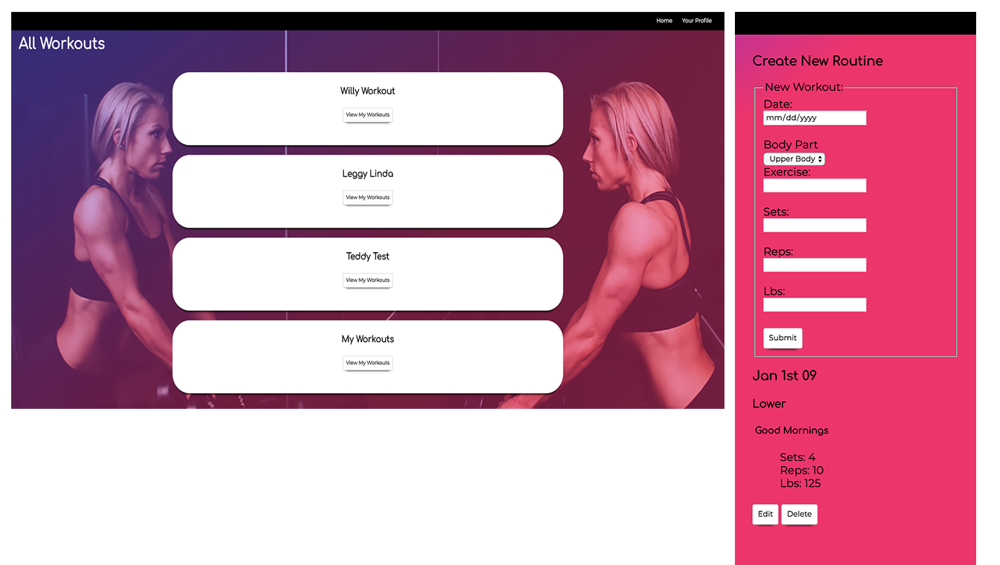

# Group-Fit
https://fierce-springs-45667.herokuapp.com/
A web app that allows a community to workout together.

### Functionality

Users can add workouts to the profiles already on the app, or create their own workout under My Profile.

### Use Case
A personal trainer could have multiple clients. This allows the trainer to tailor workouts to each of their clients in one place.
A group of friends or family may participate in a health challenge. This app will serve as a method of accountability
for everyone involved. Everyone can see how often participants are working out.

### Prerequisites

The user will need Node.js as a prerequisite.

### Setup
Clone this repo to your desktop and run `npm install` to install all the dependencies. Once everything is installed, run `nodemon server.js`
in the terminal to start the server. The local host is set to 9000. Open your browser and input the URL https://localhost:9000/.

### Running the tests
In the terminal:

 `npm test`
  
### Built With
- Node.js
- Express
- JavaScript (ES6)
- jQuery
- HTML
- CSS
- Mongo DB
- Heroku

### Tested With
- Mocha.js
- Chai.js
- Travis CI
